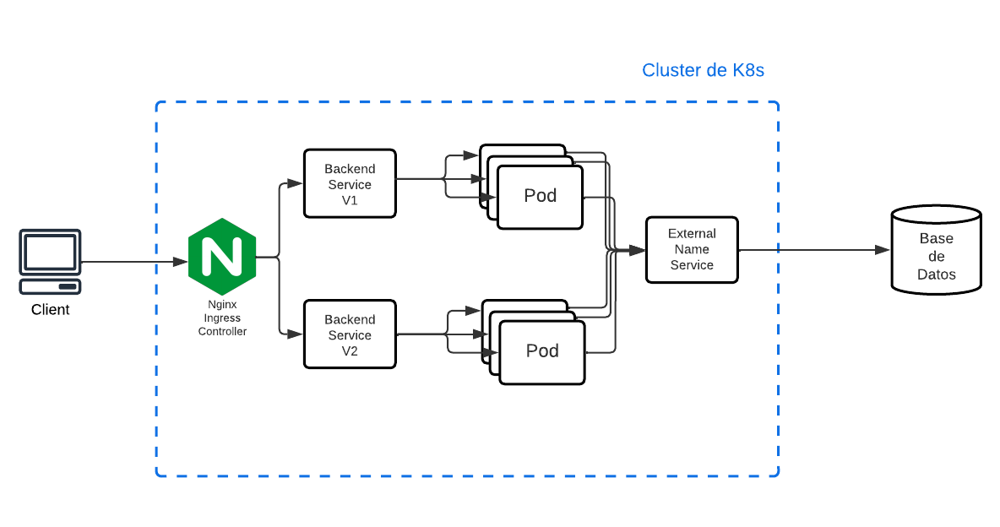

# Autores
- [Francisco Bernad](https://github.com/FrBernad)
- [Nicolás Rampoldi](https://github.com/NicolasRampoldi)
- [Agustín Manfredi](https://github.com/imanfredi)

# TP Especial Kubernetes

## Consigna
- Crear un cluster de Kubernetes de un Master y al menos dos slave, que exponga
una API en un puerto genérico (distinto a 80) (mostrar el pod del q viene)
- Implementar una base de datos local en un servidor y exponer un servicio que
redireccione el tráfico del cluster al servidor.
- Deployar un web server (nginx o Apache HTTPD escuchando en el 80) y hacer
un proxy reverso a la API. (Usar un ingress controller)
- Mostrar dos versiones de API distintas conviviendo (dos servicios distintos nomás bastan)
- Opcional: Integrar los servicios de Istio y Kiali al cluster.


## Docker
Para poder inicializar el cluster de Kubernetes es necesario contar con Docker instalado.
A continuación se mostrarán los pasos sobre cómo realizar la [instalación de Docker en Ubuntu](https://docs.docker.com/engine/install/ubuntu/). 
### Desintalación de versiones obsoletas
```bash
sudo apt-get remove docker docker-engine docker.io containerd runc
```
### Instalación utilizando el repositorio apt
#### Set up del repositorio
```
sudo apt-get update
```
```bash
sudo apt-get install ca-certificates curl gnupg
```
```bash
sudo install -m 0755 -d /etc/apt/keyrings
```
```bash
curl -fsSL https://download.docker.com/linux/ubuntu/gpg | sudo gpg --dearmor -o /etc/apt/keyrings/docker.gpg
```
```bash
sudo chmod a+r /etc/apt/keyrings/docker.gpg
```
```bash
echo \
  "deb [arch="$(dpkg --print-architecture)" signed-by=/etc/apt/keyrings/docker.gpg] https://download.docker.com/linux/ubuntu \
  "$(. /etc/os-release && echo "$VERSION_CODENAME")" stable" | \
  sudo tee /etc/apt/sources.list.d/docker.list > /dev/null
```
#### Instalación del docker engine

```bash
sudo apt-get update
```
```bash
sudo apt-get install docker-ce docker-ce-cli containerd.io docker-buildx-plugin docker-compose-plugin
```

Este ultimo comando descarga la imagen hello-world y corre el contenedor. Si ves un mensaje de confirmación, Docker ha sido instalado correctamente.
```bash
sudo docker run hello-world
```
Puede encontrar más detalles sobre cómo realizar la instalación en otras plataformas en el siguiente [link](https://docs.docker.com/engine/install/)

#### Creación de usuario y grupo de docker
Es necesario crear un grupo y usuario de docker para que no sea necesario correr los contenedores como root. Esto se logra con los siguientes comandos.
sudo groupadd docker

Se crea el grupo de docker.
```bash
sudo groupadd docker
```
Se crea un usuario y se lo agrega al grupo.
```bash
sudo usermod -aG docker ${USER}
```
Es necesario desloguearse y volver a loguearse para que se apliquen los cambios.

Verificar que se pueda correr el siguiente comando
```bash
docker run hello-world
```
## Kind
Kind es una herramienta que permite correr cluster de Kubernetes de forma local, utilizando contenedores de Docker.
### Instalación
Continuaremos con la instalación de Kind que permitirá montar un cluster de kubernetes. Con Kind se podrá especificar el número de nodos worker y de nodos control plane.
A continuación se mostrarán los pasos sobre cómo realizar la [instalación de Kind en Linux](https://kind.sigs.k8s.io/docs/user/quick-start/#installing-from-release-binaries).


```bash
- Para AMD64 / x86_64
[ $(uname -m) = x86_64 ] && curl -Lo ./kind https://kind.sigs.k8s.io/dl/v0.19.0/kind-linux-amd64
- Para ARM64
[ $(uname -m) = aarch64 ] && curl -Lo ./kind https://kind.sigs.k8s.io/dl/v0.19.0/kind-linux-arm64
```

```bash
chmod +x ./kind
```

```bash
sudo mv ./kind /usr/local/bin/kind
```
Puede encontrar más detalles sobre cómo realizar la instalación en otras plataformas en el siguiente [link](https://kind.sigs.k8s.io/docs/user/quick-start/#installation)


### Creación de cluster

Antes de comenzar, clonar el repositorio del siguiente [link de Github](https://github.com/FrBernad/TPE-redes-kubernetes)
Puede ejecutar el siguiente comando para hacerlo:
```bash
git clone git@github.com:FrBernad/TPE-redes-kubernetes.git
```
Moverse dentro del directorio del repositorio clonado.
```bash
cd ./TPE-redes-kubernetes
```
En los siguientes pasos se mencionará cómo conseguir la siguiente arquitectura:



En primer lugar realizaremos un build de la imagen de la base de datos. La imagen no será instanciada dentro del cluster de Kubernetes. El cluster se comunicará con la base de datos a través de la exposición de un servicio externo. 
Se tomó esta decisión para simular una situación más real, en la que la base de datos de datos no suele encontrarse dentro del cluster.

Luego vamos a instanciar el contenedor con docker-compose que se encargará de buildear la imagen de la base de datos, de setear las variables de entorno necesarias y de configurar el volumen persistente.

```bash
docker compose  -f ./database/docker-compose.yml up -d
```

A continuación, vamos a crear el cluster de Kubernetes utilizando la configuración que se encuentra en el archivo kind-config/multi-cluster-config.yaml bajo el nombre de "redes".
En el archivo se especifica la cantidad de nodos worker y de nodos control plane.

```yaml
kind: Cluster
apiVersion: kind.x-k8s.io/v1alpha4
nodes:
- role: control-plane
- role: worker
- role: worker
```
Para la creación del cluster ejecutamos el siguiente comando:
```bash
kind create cluster --config kind-config/multi-cluster-config.yaml --name redes 
```
Una vez que se inicializa el cluster, podemos ver información del mismo con el siguiente comando:
```bash
kubectl cluster-info --context kind-redes
```
Además podemos ver el cluster:

```bash
kind get clusters
```
Por último podemos ver los tres nodos corriendo:
```bash
kubectl get nodes
```

A continuación vamos a buildear las imágenes para instanciar los contenedores que correrán en los nodos worker. 

- Para la versión 1 de la API
```bash
docker build -t movies:v1 ./k8/backend/movies/v1/image
```

- Para la versión 2 de la API
```
docker build -t movies:v2 ./k8/backend/movies/v2/image
```

Es necesario cargar las imágenes al cluster para poder instanciarlas. Cargamos las dos imágenes al cluster "redes".

```
kind load docker-image movies:v1 --name redes
```
```
kind load docker-image movies:v2 --name redes
````

Ahora vamos a aplicar el manifiesto de la base de datos que se encargará de levantar un servicio. El servicio expondrá un nombre, con el cual podrán comunicarse mediante DNS los demás servicios y/o pods con la base de datos que levantamos anteriormente. 
```
kubectl apply -f ./k8/database
```

Veamos en que IP está corriendo la base de datos
```
docker inspect database
```
Copiamos la IP que aparezca en el campo IPAddress.

Agregaremos en nuestro archivo /etc/hosts la siguiente línea.

> [IP base de datos] database

Ahora vamos a aplicar los manifiestos que se encargará de hacer un deployment de los contenedores que contienen el backend, y además los servicios que permiten la comunicación con los pods.


```
kubectl apply -f ./k8/backend/movies/secret.yaml 
```

```
kubectl apply -f ./k8/backend/movies/v1
```

```
kubectl apply -f ./k8/backend/movies/v2
```

Nos queda aplicar el manifiesto del ingress que sirve como punto de acceso al cluster de kubernetes. Recordar que los servicios de Kubernetes que fueron levantados anteriormente, son solo accesibles desde dentro del cluster. En el caso de ingress, permite que este pueda ser accedido desde afuera.

El ingress podrá ser accedido mediante DNS. Para ello es necesario agregar la siguiente línea en /etc/hosts
```
127.0.0.1 api.movies.com
```
Aplicamos los manifiestos del ingress

```
kubectl apply -f ./k8/ingress --recursive
```

Chequear que el ingress-controller esté corriendo. Se puede chequear mediante el comando
```
kubectl -n ingress-nginx get pods
```

Hacemos un port forwarding del servicio de ingress-controller
```
kubectl -n ingress-nginx port-forward svc/ingress-nginx-controller --address 0.0.0.0 5000:80&
```


Podemos ahora realizar llamados a la API en los respectivos endpoints de cada una

```
curl api.movies.com:5000/v1/movies?name=titanic
```

```
curl api.movies.com:5000/v2/movies?name=titanic
```

###  Monitoreo del cluster

Para el monitoreo del cluster se utiliza la herramienta Istio y Kiali.
Istio se encargará de recolectar métricas y analizar el comportamiento de nuestro cluster, mientras que Kiali brindará una interfaz visual tomando los datos que ofrece Istio. 

> Instalación

```
curl -L https://istio.io/downloadIstio | sh -
```

```
cd istio-x 
```
donde x será la versión que instalamos

```
export PATH=$PWD/bin:$PATH
```

> Monitoreo

```
istioctl install --set profile=default -y
```

```
kubectl label namespace default istio-injection=enabled
```

```
kubectl label namespace ingress-nginx istio-injection=enabled --overwrite
```

```
kubectl apply -f https://raw.githubusercontent.com/istio/istio/release-1.17/samples/addons/kiali.yaml
```

```
kubectl apply -f https://raw.githubusercontent.com/istio/istio/release-1.17/samples/addons/prometheus.yaml
```

```
istioctl dashboard kiali --address 0.0.0.0 &
```


