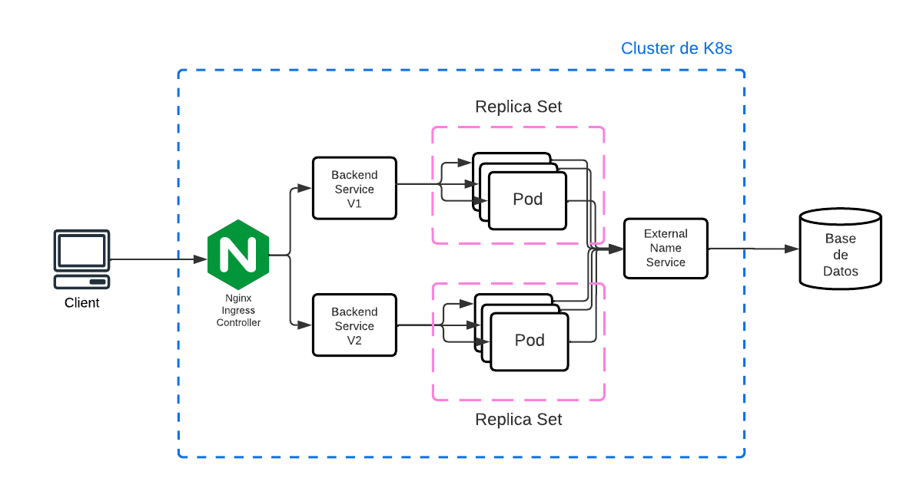

# Autores
- [Francisco Bernad](https://github.com/FrBernad)
- [Nicolás Rampoldi](https://github.com/NicolasRampoldi)
- [Agustín Manfredi](https://github.com/imanfredi)

# TP Especial Kubernetes

## Consigna
- Crear un cluster de Kubernetes de un Master y al menos dos slave, que exponga
una API en un puerto genérico (distinto a 80). Exhibir como la información es enviada
desde distintos Pods.
- Implementar una base de datos local en un servidor (fuera del cluster de Kubernetes) 
y exponer un servicio de Kubernetes que redireccione el tráfico del cluster al servidor.
- Deployar un web server (nginx o Apache HTTPD escuchando en el 80) y hacer
un proxy reverso a la API. Puede utilizarse un ingress controller.
- Mostrar dos versiones de API distintas conviviendo.
- Opcional: Integrar los servicios de Istio y Kiali al cluster.

# Instalación

## Entorno
El proceso de instalación será explicado para un ambiente de trabajo con Ubuntu 22.04.2 LTS. 

## Docker
Para poder inicializar el cluster de Kubernetes es necesario contar con Docker instalado.
A continuación se mostrarán los pasos sobre cómo realizar la [instalación de Docker en Ubuntu](https://docs.docker.com/engine/install/ubuntu/). 
### Desintalación de versiones obsoletas
```bash
sudo apt-get remove docker docker-engine docker.io containerd runc
```
### Instalación utilizando el repositorio apt
### Set up del repositorio
```
sudo apt-get update
```
```bash
sudo apt-get install ca-certificates curl gnupg
```
```bash
sudo install -m 0755 -d /etc/apt/keyrings
```
```bash
curl -fsSL https://download.docker.com/linux/ubuntu/gpg | sudo gpg --dearmor -o /etc/apt/keyrings/docker.gpg
```
```bash
sudo chmod a+r /etc/apt/keyrings/docker.gpg
```
```bash
echo \
  "deb [arch="$(dpkg --print-architecture)" signed-by=/etc/apt/keyrings/docker.gpg] https://download.docker.com/linux/ubuntu \
  "$(. /etc/os-release && echo "$VERSION_CODENAME")" stable" | \
  sudo tee /etc/apt/sources.list.d/docker.list > /dev/null
```
### Instalación del docker engine

```bash
sudo apt-get update
```
```bash
sudo apt-get install docker-ce docker-ce-cli containerd.io docker-buildx-plugin docker-compose-plugin
```

Este último comando descarga la imagen hello-world y ejecuta el contenedor. Si ves un mensaje de confirmación, Docker ha sido instalado correctamente.
```bash
sudo docker run hello-world
```
Puede encontrar más detalles sobre cómo realizar la instalación en otras plataformas en el siguiente [link](https://docs.docker.com/engine/install/)

### Creación de usuario y grupo de docker
Es necesario crear un grupo y usuario de docker para que no sea necesario correr los contenedores como root. Esto se logra con los siguientes comandos.

Se crea el grupo de docker.
```bash
sudo groupadd docker
```
Se crea un usuario y se lo agrega al grupo.
```bash
sudo usermod -aG docker ${USER}
```
Es necesario desloguearse y volver a loguearse para que se apliquen los cambios.

Verificar que se pueda correr el siguiente comando
```bash
docker run hello-world
```
## Kind
Kind es una herramienta que permite correr un cluster de Kubernetes de forma local, utilizando contenedores de Docker.
### Instalación
Continuaremos con la instalación de Kind que permitirá montar un cluster de kubernetes. Con Kind se podrá especificar el número de nodos worker y de nodos del control plane.
A continuación se mostrarán los pasos sobre cómo realizar la [instalación de Kind en Linux](https://kind.sigs.k8s.io/docs/user/quick-start/#installing-from-release-binaries).

Primero descargamos el ejecutable compatible con nuestra arquitectura.
```bash
- Para AMD64 / x86_64
[ $(uname -m) = x86_64 ] && curl -Lo ./kind https://kind.sigs.k8s.io/dl/v0.19.0/kind-linux-amd64
- Para ARM64
[ $(uname -m) = aarch64 ] && curl -Lo ./kind https://kind.sigs.k8s.io/dl/v0.19.0/kind-linux-arm64
```

Le damos permiso de ejecucion.
```bash
chmod +x ./kind
```

Lo movemos dentro una carpeta que se encuentre dentro de la variable $PATH.
```bash
sudo mv ./kind /usr/local/bin/kind
```
Puede encontrar más detalles sobre cómo realizar la instalación en otras plataformas en el siguiente [link](https://kind.sigs.k8s.io/docs/user/quick-start/#installation)


## Proyecto 
### Creación de cluster

Antes de comenzar, clonar el repositorio del siguiente [link de Github](https://github.com/FrBernad/TPE-redes-kubernetes)
Puede ejecutar el siguiente comando para hacerlo:
```bash
git clone git@github.com:FrBernad/TPE-redes-kubernetes.git
```
Moverse dentro del directorio del repositorio clonado.
```bash
cd ./TPE-redes-kubernetes
```
En los siguientes pasos se mencionará cómo levantar un cluster de kubernetes para una aplicación
con la siguiente arquitectura:



En primer lugar realizaremos el build de la imagen de la base de datos. 
La imagen no será instanciada dentro del cluster de Kubernetes. 
El cluster se comunicará con la base de datos mediante un servicio de kubernetes encargado de exponerla.
Se tomó esta decisión para simular que la base de datos actúe como un servicio externo (como indica la consigna).
En situaciones reales, la base de datos no suele encontrarse dentro del cluster.

Luego instanciaremos el contenedor con docker-compose, que se encargará de buildear la imagen de la base de datos, de establecer las variables de entorno necesarias y de configurar el volumen persistente.

```bash
docker compose  -f ./database/docker-compose.yml up -d
```

A continuación, crearemos el cluster de Kubernetes utilizando la configuración que se encuentra en el archivo kind-config/multi-cluster-config.yaml bajo el nombre de "redes".
En el archivo se especifica la cantidad de nodos worker y de nodos del control plane.

```yaml
kind: Cluster
apiVersion: kind.x-k8s.io/v1alpha4
nodes:
- role: control-plane
- role: worker
- role: worker
```

Para la creación del cluster ejecutaremos el siguiente comando:
```bash
kind create cluster --config kind-config/multi-cluster-config.yaml --name redes 
```
Esto creará un cluster dentro del contexto ***redes***


Una vez inicializado el cluster, podemos ver los clusters disponibles con el siguiente comando:
```bash
kind get clusters
```

Además, podemos ver información especifica del cluster de la siguiente manera:
```bash
kubectl cluster-info
```

Por último, pueden visualizarse los tres nodos corriendo:
```bash
kubectl get nodes
```

A continuación vamos a buildear las imágenes para instanciar los contenedores que correrán en los nodos worker. 

- Para la versión 1 de la API
```bash
docker build -t movies:v1 ./k8/backend/movies/v1/image
```
Esto creará una imagen con el tag ***movies:v1***

- Para la versión 2 de la API
```
docker build -t movies:v2 ./k8/backend/movies/v2/image
```
Esto creará una imagen con el tag ***movies:v2***

Es necesario cargar las imágenes dentro cluster para poder instanciarlas. 

Cargamos las dos imágenes al cluster "redes":
```
kind load docker-image movies:v1 --name redes
```
```
kind load docker-image movies:v2 --name redes
````

Ahora vamos a aplicar el manifiesto de la base de datos que se encargará de levantar un servicio
de tipo *ExternalName*. 
Este tipo de servicios, permiten la comunicación mediante DNS de los demás 
servicios y/o pods con la base de datos que levantamos anteriormente. 
```
kubectl apply -f ./k8/database
```

Para poder resolver la consulta dns a la base de datos, deberemos configurar
la entrada de manera local en la maquina host.
Veamos cual es la ip del host
```
ip a
```
Copiamos la ip del host asignada a cualquier interfaz que no sea loopback.
Puede por ejemplo ser la interfaz de docker o la interfaz fisica.

Agregaremos en nuestro archivo /etc/hosts la siguiente línea.

> [IP base de datos] database

Ahora vamos a aplicar los manifiestos que se encargarán de desplegar el deployment con los contenedores 
del backend, y además los servicios que permiten la comunicación con los pods del mismo.

Primero, aplicamos el objeto de kubernetes de tipo ***secret*** que permite establecer variables de entorno para el backend.
```
kubectl apply -f ./k8/backend/movies/secret.yaml 
```

Luego, procedemos a aplicar los manifiestos de ambas versiones del backend.
```
kubectl apply -f ./k8/backend/movies/v1
```

```
kubectl apply -f ./k8/backend/movies/v2
```

Nos queda aplicar el manifiesto del ingress. Este actuará como punto de acceso al cluster de kubernetes. 
Recordar que los servicios de Kubernetes que fueron levantados anteriormente, son solo accesibles desde dentro del cluster. 
En el caso del ingress, permite el acceso desde afuera.

El ingress definirá reglas de redireccion para el nombre ***api.movies.com***. 
Para poder ser accedido de manera local mediante DNS, es necesario agregar la siguiente línea en el archivo ***/etc/hosts***.
```
127.0.0.1 api.movies.com
```

Aplicamos los manifiestos del ingress
```
kubectl apply -f ./k8/ingress --recursive
```

Chequear que el ingress-controller esté corriendo mediante el comando:
```
kubectl -n ingress-nginx get pods
```

Una vez asegurado que esté corriendo el pod, hacemos un port forwarding del servicio de ingress-controller:
```
kubectl -n ingress-nginx port-forward svc/ingress-nginx-controller --address 0.0.0.0 5000:80&
```
Esto es necesario ya que en un caso real, el ingress tendría asignada una IP pública para accederlo.
En nuestro caso, al tener todo levantado de manera local, no se cuenta con una IP pública y se
fowardeará el servicio hacia afuera del cluster para poder ser accedido desde la máquina host.

Podemos ahora realizar llamados a la API en sus respectivos endpoints.
```
curl "api.movies.com:5000/v1/"
curl "api.movies.com:5000/v1/movies?name=titanic"
```

```
curl "api.movies.com:5000/v2/"
curl "api.movies.com:5000/v2/movies?name=titanic"
```

En las respuestas de cada llamado, además de la información del endpoint, se obtendrá
la IP y nombre del pod que respondió y el nombre del nodo en el que se encuentra.

### Monitoreo del cluster

Para el monitoreo del cluster se utilizarán las herramientas Istio y Kiali, junto a otras utilidades como Prometheus.
Istio es un service mesh que permite controlar el tráfico entre servicios dentro del cluster de kubernetes. Por otro lado,
Kiali permite visualizar, mediante una interfaz gráfica, el estado de cada componente de la red recolecando métricas con 
Prometheus.

#### Instalación

```
curl -L https://istio.io/downloadIstio | ISTIO_VERSION=1.17.2 TARGET_ARCH=x86_64 sh -
```

```
cd istio-1.17.2
```

```
export PATH=$PWD/bin:$PATH
```

#### Monitoreo

```
istioctl install --set profile=default -y
```

```
kubectl label namespace default istio-injection=enabled
```

```
kubectl apply -f https://raw.githubusercontent.com/istio/istio/release-1.17/samples/addons/kiali.yaml
```

```
kubectl apply -f https://raw.githubusercontent.com/istio/istio/release-1.17/samples/addons/prometheus.yaml
```

```
istioctl dashboard kiali --address 0.0.0.0 &
```

## Frontend
Instalar node 18 LTS con el siguiente comando:
```bash
curl -fsSL https://deb.nodesource.com/setup_lts.x | sudo -E bash - &&\
sudo apt-get install -y nodejs  
```

Entrar a la carpeta del frontend y ejecutar:
```bash
npm run dev
```

Acceder desde un browser a la ip dada por el output del comando anterior.


